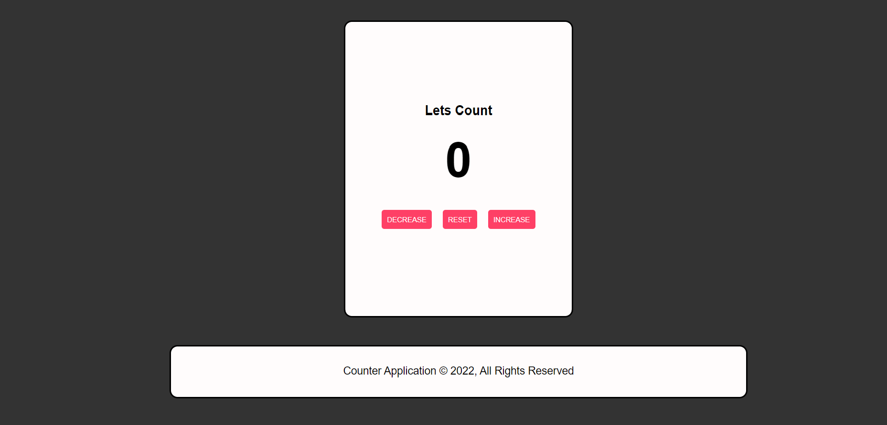

# Counter-Application 

🔹 Application of counter by pressing a button.

🔹There are three buttons, increase, decrease, reset. 

🔹With each click the counter will be updated and her color: 

🔴 When the rating is a number below 0.

⚫ When the counter is equal.

🟢 When the counter value bigger than 0.




## Technologies

👉 HTML5

👉 CSS3

👉 JavaScript

## for any questions

```
if(haveAnyQuestions === true){
    let yourName = ".......", question = ".......";
    sendEmailToMe(yourName,question,odedatias8115@gmail.com);
}
```
